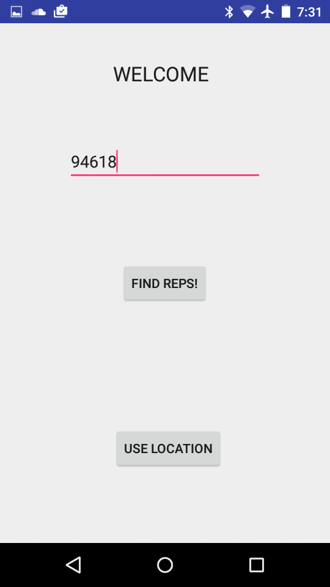
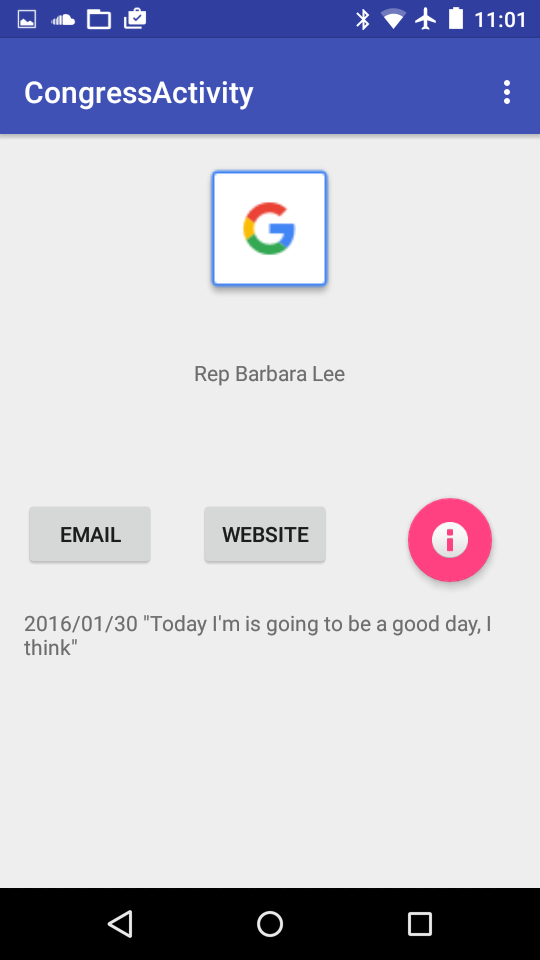
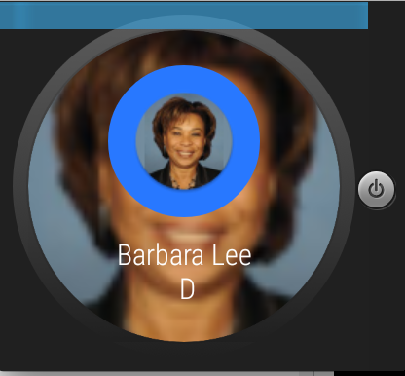
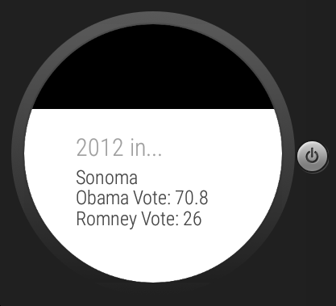

# PROG 02: Represent!

This is the partway point for Project 02. This part accomplishes functionality
between watch->phone and phone->watch communication. It also renders very basic
views.

## Authors

Ko Costarella ([ko.costarella@berkeley.edu](mailto:ko.costarella@berkeley.edu))

## Demo Video
password: cs160
See [Represent2B] (https://vimeo.com/157675518)

## Screenshots

## Acknowledgments

* Hat tip to me
