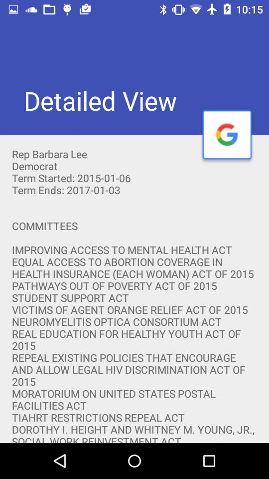
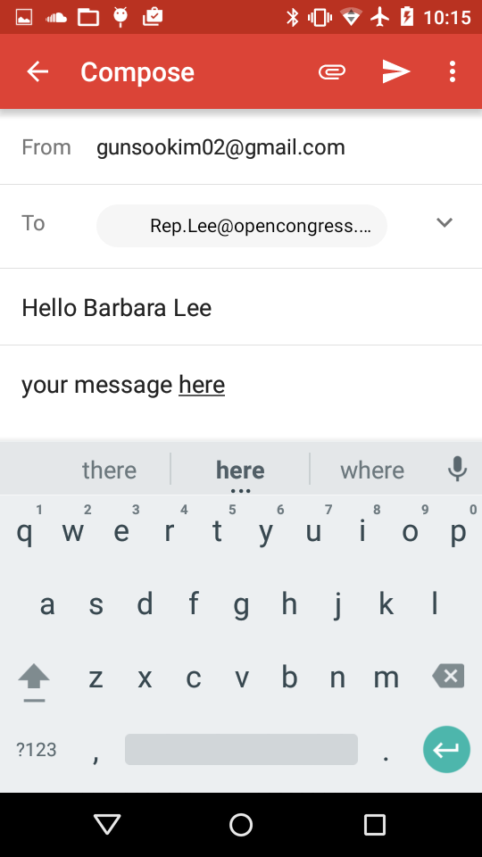
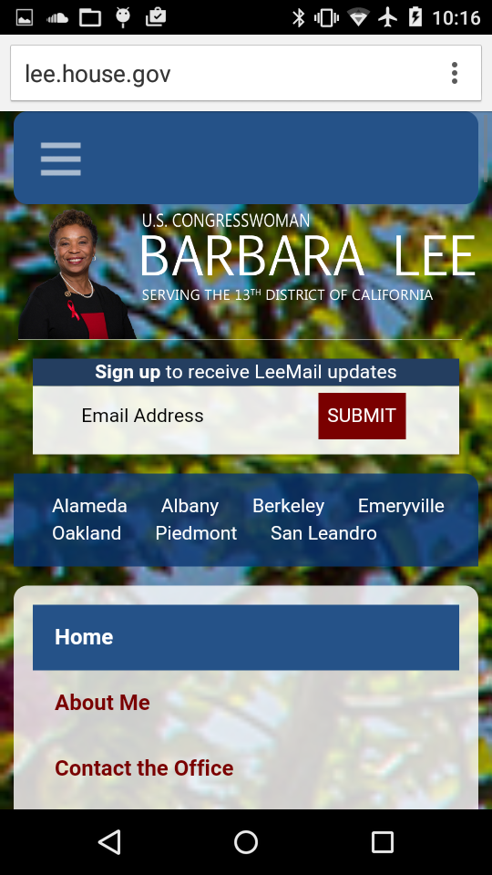
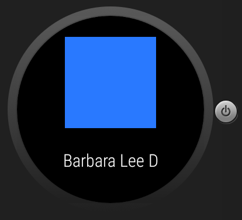
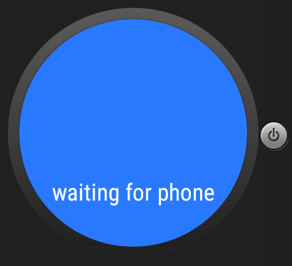

# PROG 02: Represent!

This is Project 02. This part accomplishes API connection For the app.

## Authors

Ko Costarella ([ko.costarella@berkeley.edu](mailto:ko.costarella@berkeley.edu))

## Demo Video
password: cs160 (same for both)
See [Represent2B] (https://vimeo.com/157675518)
See [Represent2C] (https://vimeo.com/158716831)
## Screenshots

## Acknowledgments

* Hat tip to me...
